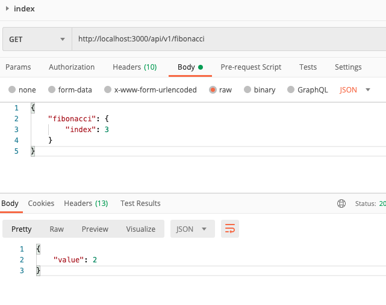

# ControllHubPablo
This is a REST API to get the index value of the fibonacci sequence
## Requirements
This API is building on Ruby 3.0.2, first you have to sure that you have that version in your environment, if you do not know how to install Ruby, I recomended to do with rben, for this following the next instructions:

[Download and install ruby with Rbenv](https://github.com/rbenv/rbenv)

## Before to start
This project has a Makefile to simplify to use of some commands if you want to see the list only to exec this:
```bash
$ make help

rubocop-fix                    Run rubocop with auto-fix
rubocop                        Run rubocop
setup                          Install dependencies from Gemfile.
start                          Start application
test                           Run test
```
## Documentation
In this link you can get the postman the documentation: 
[Documentación en Postman](https://documenter.getpostman.com/view/2220937/Uz5FJw98)

## Instalation
After to install Ruby 3.0.2 correctly, follow the best practices to have a good work environment:

- Clone the repository with the next commands:

```bash
git clone git@github.com:your_user/controll_pablo.git && cd controll_pablo
```

Afteryou have to exec the next command to install all dependencies:
```bash
$ make setup
```
## User guide
To test the project in your local environment only you have to exec the next command:
```bash
$ make start
```
## Tests
The testing is with [Rspec](https://rspec.info/), if you want to exec the test suite, only you have to exec the next command:
```bash
$ make test
```
## Linter
To save the good practics, style guides and avoid code smell, this project uses `Rubocop`, only you nedd to exec the next command:
```bash
$ make rubocop
```
